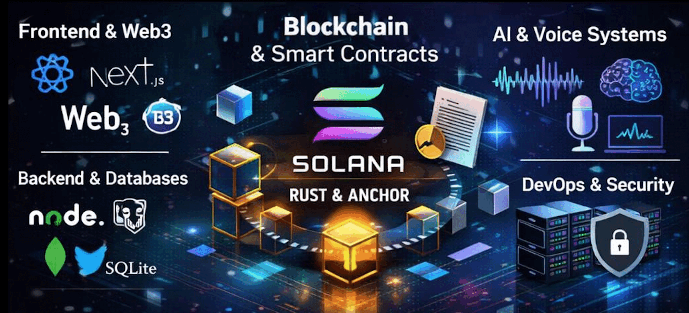

<!-- ===================== HERO / BANNER ===================== -->

  

  

<h1 align="center">Rashid Ali</h1>

<h3 align="center">
Senior Full-Stack Engineer • Web3 & Solana Specialist • AI Systems Builder
</h3>

Building production-grade AI & Blockchain systems for real-world scale

  
  
  

---

## 🚀 Summary

I am a **Senior Full-Stack AI & Blockchain Engineer** with **5+ years** of experience building:

-  **AI SaaS platforms & real-time voice systems**
-  **Solana smart contracts (Rust / Anvhor)**
-  **Web3 integration and React Frontend**
-  **Scalable Next.js & Node.js backends**
-  **Research-driven, security-focused architectures**

I specialize in **turning ideas into production systems**, from **protocol design → smart contracts → frontend → payments → scaling**.

---

## 🧠 Core Technology Stack

### Programming Languages

### Frontend

### Backend

### Blockchain / Web3

### DevOps & Tools

---

## 🎓 Education

| Degree | Institution | Duration |
|------|------------|---------|
| **MPhil – Computer Science** | Superior University 
| **BSSE – Software Engineering** | Lahore Leads University 

---

## 🏗️ Selected Projects 

### 🌌 AstroMind – AI SaaS Platform

AI-powered astrology SaaS with Stripe subscriptions, admin panel, and ML-driven insights.

**Tech:** Next.js, Python, MongoDB, Stripe

---

### 🍻 MintsClub – NFT Marketplace (Blockchain)

NFTs market pleace where users can trade nfts on blockchain.

**Tech:** React, Node, Solana, Anchor (Rust)

---

### 🍻 SolDrunks – NFT Staking (Solana)

Stake whitelisted NFTs and earn rewards using Solana smart contracts.

**Tech:** React, Solana, Anchor (Rust)

---

### 🎟️ DRaffle – Raffle System (Solana)

Decentralized raffle system with crypto ticketing and provable winners.

**Tech:** React, Solana

---

### 🧰 Handyman Application (Final Year Project)

A mobile platform connecting users with verified blue-collar professionals across Pakistan.

**Tech:** React, Node.js, REST APIs

---

## 🔬 Advanced Blockchain Engineering

-  **Solana Arbitrage Bot** – Dex price difference trading
-  **Invostash** – Solana smart contracts (Rust + Anchor)
-  **PayKingdom** – ICO platform for EVM chains
-  **MintsClub** – Multichain NFT marketplace
-  **Immutabulls / AcidToadz / MellowMen** – NFT minting & staking

---

## 🤖 AI Engineering

-  **AI Voice & Audio Systems** – Real-time streaming, chunking, low-latency TTS (Node.js)  
-  **LLM Integration** – GPT-based conversational APIs and prompt handling  
-  **RAG & Document Processing** – PDF ingestion, embeddings, semantic search  
-  **Machine Learning** – Ensemble predictive models, IEEE-published research  
-  **AI SaaS** – AstroMind platform with admin panels and Stripe subscriptions

---

## 📚 Research & Publications

- **Predictive Modelling of Diabetes Using Ensemble Classifiers**  
  *IEEE Xplore – March 2025*

- **Authentication of User Data for Enhancing Privacy in Cloud Computing**  
  *CRC Press – Jan 2025*

---

## 🐍 Contribution Snake (Animated)

<picture>
  <source media="(prefers-color-scheme: dark)"
    srcset="https://raw.githubusercontent.com/rashidkhokhar98/rashidkhokhar98/output/dist/github-contribution-grid-snake-dark.svg" />
  <source media="(prefers-color-scheme: light)"
    srcset="https://raw.githubusercontent.com/rashidkhokhar98/rashidkhokhar98/output/dist/github-contribution-grid-snake.svg" />
  
</picture>

---

## 💼 What I Bring to Teams & Startups

- ✅ Production-ready engineering
- ✅ Strong ownership mindset
- ✅ Web3 protocol understanding
- ✅ AI + Blockchain system design
- ✅ Research-backed decisions

---

## ⚡ Philosophy

> **“Don’t just build features — build systems that scale and survive.”**
